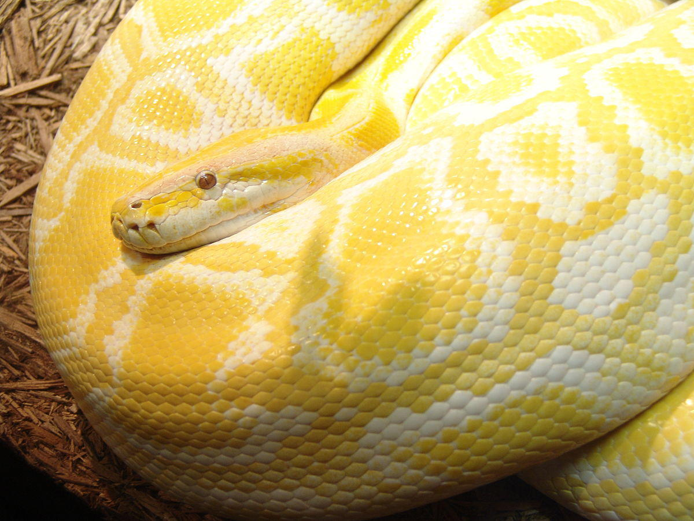

# CS325_A1

> This assignment shows what we learned with README files, git, github, and conda

---

## Features

    - Feature1
    - Feature2

> There are two features added in this project

---

## Installation

    1. step one
    2. step two
    3. step three

> Installation steps

---

```python

    print("hello world")

```

---

